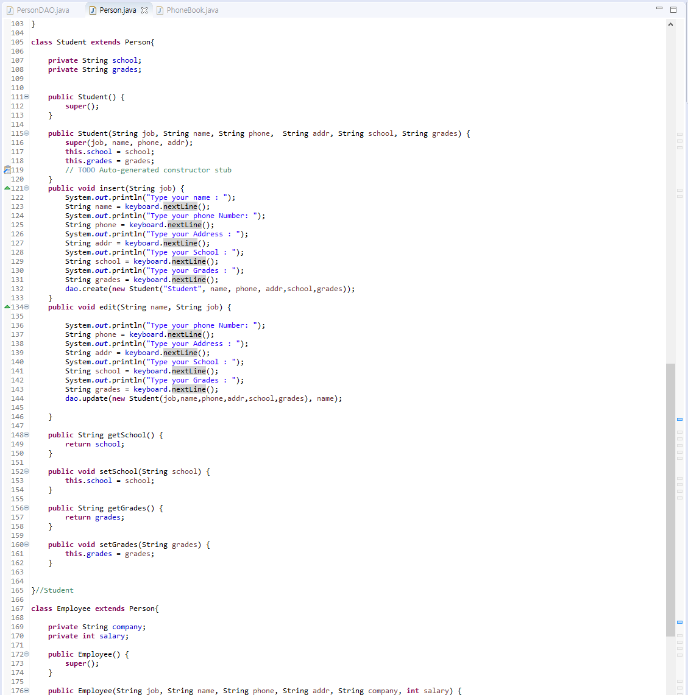

# PhoneBook
#### Telephone directory connected to Database(mySQL).
There are three types of jobs such as student, employee, and others as a person.
Each jobs have different information according to its features that can save different data,
displaying various information.
User can create, read, update, and delete data while running a program.

# Using Technology
#### JAVA, MySQL

# Database
By suing mySQL, it is able to store the data from java program.
 The spreadsheet is created on SQL Querry table.

# Polymorphism 
To make model data various, the data is extended with various types such as employee or student.
 Each of types contain different features based on the job characteristics.

Furthermore, methods also have different functionalities based on the model data.
 Method overloading allows a class to have more than one method having the same name, 
 if their argument lists are different.

