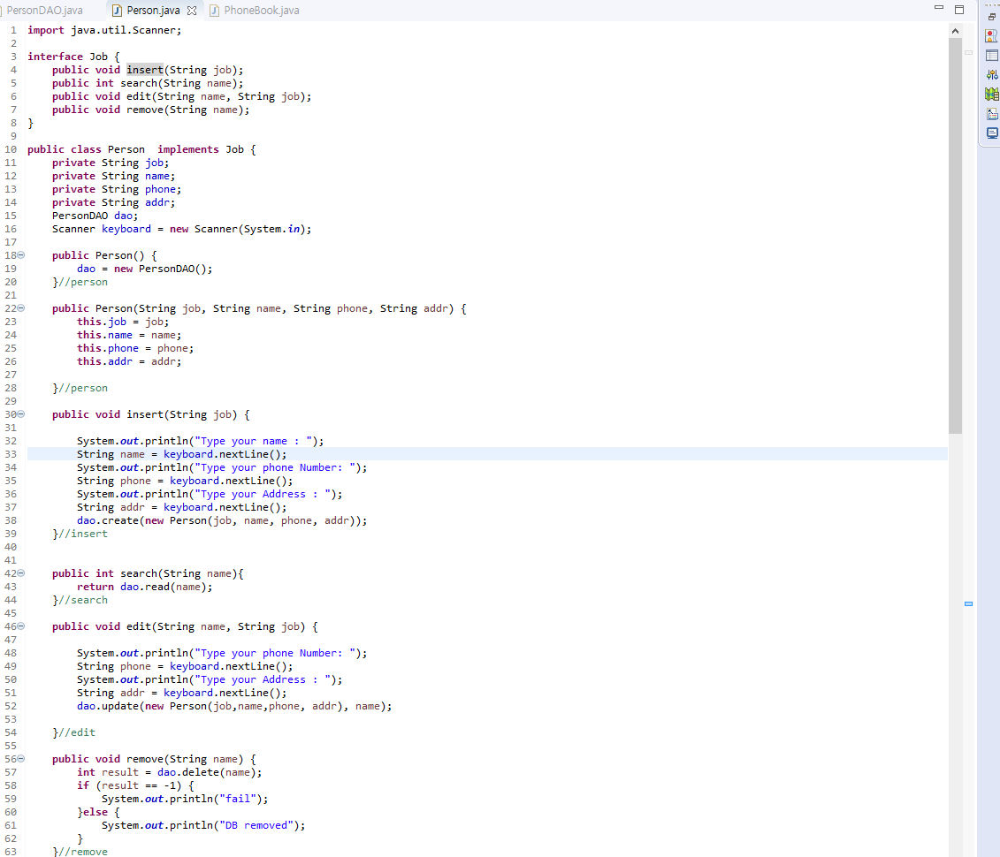

# PhoneBook
A telephone directory is connected to Database(mySQL)
# Using Technology
JAVA, MySQL, MVC

# Database
By suing mySQL, it is able to store the data from java program.
The spreadsheet is created on SQL Querry table.

# Polymorphism 
To make model data various, the data is extended with various types such as employee or student.
Each of types contain different feature based on the job characteristics.

Furthermore, methods also have different functionalities based on the model data.
Method overloading allows a class to have more than one method having the same name, if their argument lists are different.

